# Eavesdropper 🔍
Eavesdropper helps you stay immersed in busy RP environments by focusing on the interactions that matter most.

**Key Features:**
- **History Window:** A focused, real-time feed for your current target or mouseover.  
- **Dedicated Windows:** Create unique, independent windows for specific targets to track multiple conversations simultaneously.  
- **Group Windows:** Combine multiple targets into a single shared window for party or small-group interactions.  
- **Mentions:** A dedicated window listing every message that was aimed at you, from keyword hits to Blizzard emote (e.g. `/poke`, `/wave`).  
- **Keyword Highlights:** Custom keywords highlighted in chat with optional sound alerts.  
- **Notification Support:** Play a sound and flash the taskbar when your target performs an action, a Blizzard emote is directed at you, or a Dedicated/Group Window receives a message.  
- **Seamless Multi-Message Compatibility:** Built-in support for multi-message addons like Chattery, EmoteScribe, EmoteSplitter, and Yapper.  
- **Advanced RP Name Formatting:** Replaces standard names with RP names in rolls, Blizzard emotes, NPC dialogue, and Quest Text (via Dialogue UI).  
- **Profiles & Sharing:** Manage per-character profiles and export/import setups or global account settings as text strings.  
- **Keybindings:** Open the main Eavesdropper window, the settings menu, or a Dedicated Window straight from Blizzard's **Options > Keybindings** menu.  
- **ElvUI:** optional ElvUI skinning that can be toggled.
- **Localization:** Full English and French translations, with a partial Russian translation and more languages welcome.

Available on [CurseForge](https://www.curseforge.com/wow/addons/eavesdropper), [Wago.io](https://addons.wago.io/addons/eavesdropper), and [WoWInterface](https://www.wowinterface.com/downloads/info27060-Eavesdropper.html)!  

## History Window (Main)
Track conversations easily with a customizable frame displaying recent action history for your target, mouseover, or focus unit.

**Customization Options:**
- **History Size:** Adjust the number of stored actions displayed (default: 50).
- **Visuals:** Customize window styling (background color, opacity) and typography (font, size, etc.).
- **Name Formatting:** Choose how names are displayed: Full, First Name Only, or OOC.
- **New Message Indicator:** Displays a brief golden flash along the window border when a new message arrives (enabled by default under **Appearance > Display**).

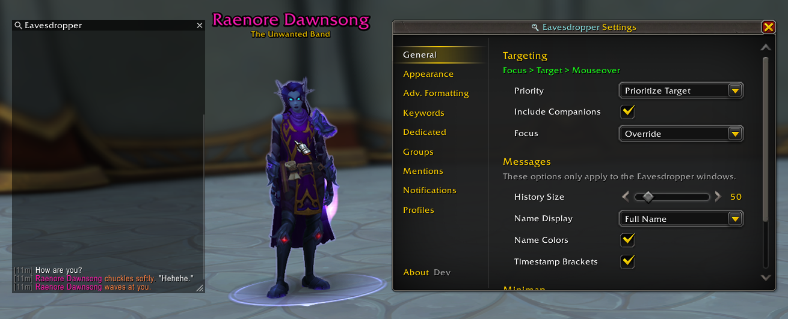

### Filters
Toggle visibility on the fly. You can filter the history window to show only specific types of interactions at any time.

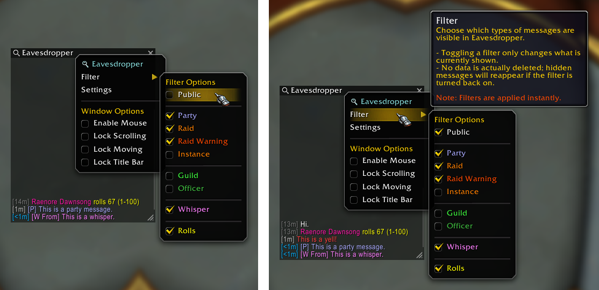

### Clean, Recognizable Layout

Each window type (Main, Dedicated, Group, Mentions) features a distinct title bar icon and a subtle scrollbar that expands on hover, thanks to [Peterodox](https://www.curseforge.com/members/peterodox/projects) for the design contribution.

The chat frames are clean and focused, stripped of unnecessary visual clutter for quick, fluid navigation.

[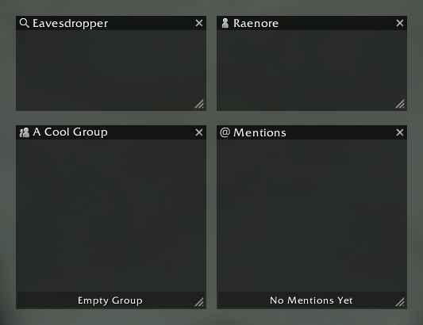](Previews/WindowIcons/WindowIcons.png)

## Dedicated Windows
Create individual Eavesdropper windows for specific targets by right-clicking a unit portrait or chat name and selecting **"Eavesdrop On"**.

Each Dedicated Window features independent:  
- **Layout & Style:** Position, Size, Font Size, and Name Display (Full/First/Original or Profile Default).  
- **Behavior & Storage:** Filters, Notifications (Sound/Flash), and New Message Indicator (notifications and indicators only trigger for messages matching that window's specific filters).

> **Note:** Dedicated Windows fully persist settings across UI reloads and game restarts while open. Reopening a window mid-session restores everything from that session instead of resetting to defaults.

[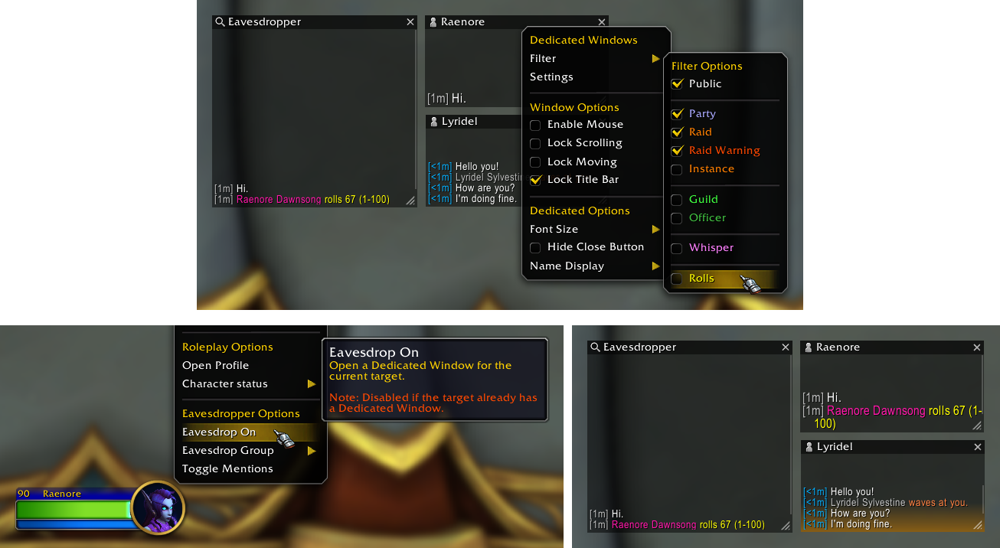](Previews/Combos/DedicatedWindows.png)  
*Click the image to view it in full size.*

## Group Windows
Consolidate interactions from multiple players into a single window by right-clicking a target portrait or chat name and selecting **"Eavesdrop Group"**. Ideal for tracking a party or a specific "circle" of characters in crowded areas.

Each Group Window features independent:
- **Layout & Style:** Position, Size, Font Size, and Name Display (Full/First/Original or Profile Default).
- **Behavior & Storage:** Filters, Notifications (Sound/Flash), New Message Indicator, and History Size (10–1000, independent of the main window).

> **Note:** Group Windows fully persist settings across UI reloads and game restarts while open. Reopening a group with the same name mid-session prompts you to either restore session data (including its player list) or reset to defaults.

**Interactions & Navigation:**
- **Sender Names:** Hover to underline and right-click for the standard player context menu (Whisper, Invite, Eavesdrop On).
- **Jump to Context:** Opens the sender's Dedicated Window scrolled directly to that message, showing the surrounding conversation.
- **Player List Menu:** Access membership directly from the title bar (sorted by RP first name). Click **Add Target** to quickly add your current target, use checkboxes to toggle members on/off, or click the per-row button to open their Dedicated Window directly.

[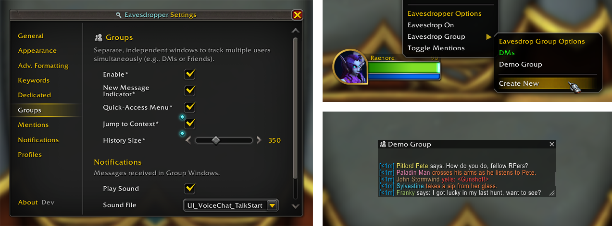](Previews/Combos/GroupWindows.png)  
*Click the image to view it in full size.*

## Mentions
A dedicated window listing every message aimed at you, whether through keyword hits or Blizzard emotes (e.g. `/poke`, `/wave`), across all channels.

Open it via `/ed mentions`, **Shift-Right-Click** on the minimap icon, or by selecting **"Toggle Mentions"** in your unit popup menu.

The Mentions window features independent:
- **Layout & Style:** Filters and New Message Indicator.
- **Behavior & Storage:** A **Mention Types** filter to toggle keyword hits and Blizzard emotes independently.

> **Note:** Mentions only record matches active at the time a message is received. Adding a keyword later will not retroactively import earlier messages.

**Interactions & Navigation:**
- **Sender Names:** Clickable sender names let you quickly interact with players.
- **Jump to Context:** Opens the sender's Dedicated Window scrolled directly to that message, showing the surrounding conversation.

[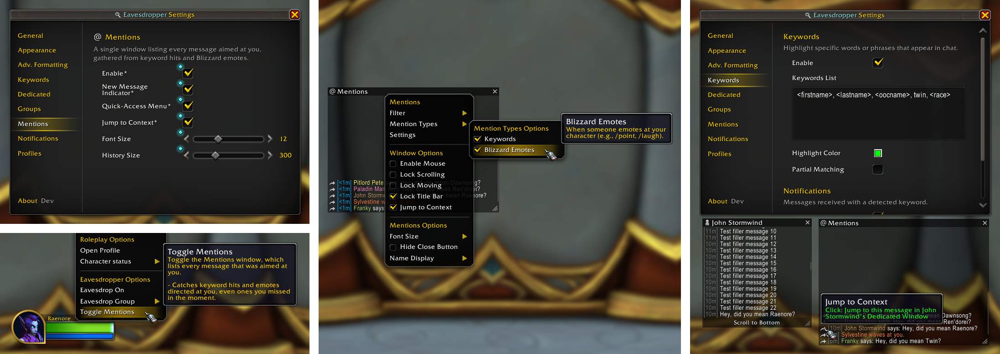](Previews/Combos/Mentions.png)  
*Click the image to view it in full size.*

## Keywords
Never miss a mention. Define custom keywords to highlight in Blizzard's chat window and configure optional audio notifications whenever they are triggered.

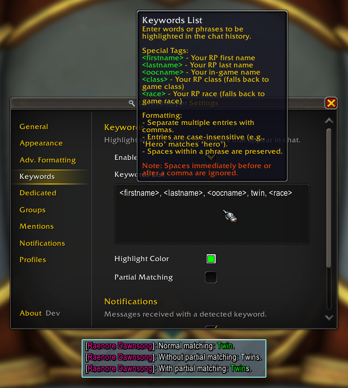

## Notifications
Configure Eavesdropper to play a sound notification or flash the taskbar when:  
- Your current target takes an action (e.g., `/say`, emotes, etc.).  
- A Blizzard emote is directed at you (e.g., `/point` or `/wave`).  

> **Note:** Notifications for Dedicated and Group windows are configured individually within their respective *Dedicated* and *Group* settings pages.  

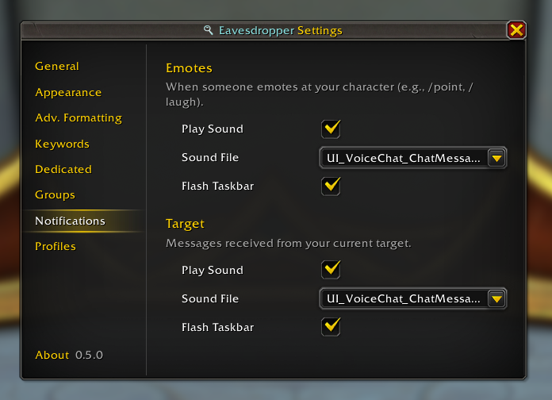

## Multi-Message Support
Eavesdropper intelligently handles long-form RP by detecting split messages from various addons, ensuring your history window stays cohesive even when an emote spans multiple posts.

While Eavesdropper is designed to be broadly compatible, the following addons are **explicitly supported**:
- [Chattery](https://www.curseforge.com/wow/addons/chattery)
- [EmoteScribe](https://www.curseforge.com/wow/addons/emotescribe)
- [Emote Splitter](https://www.curseforge.com/wow/addons/emote-splitter)
- [Yapper](https://www.curseforge.com/wow/addons/yapper-post-splitter)

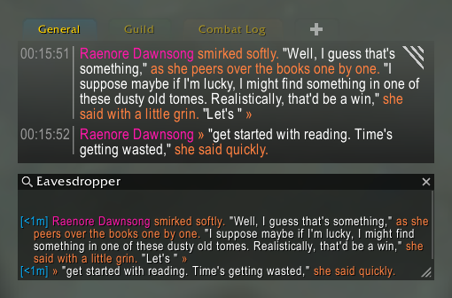  
*Multi-message support in action with **Chattery** (utilizing the "Enable RP Formatting" setting).*

## Advanced RP Name Formatting
Eavesdropper can replace standard character names with their respective RP names across the entire UI.  
This formatting applies to **all Eavesdropper windows** (History, Dedicated, Group, and Mentions) and can optionally be enabled for **Blizzard's chat window**, complete with its own independent name format setting.

**Supported Situations:**
- **Blizzard Emotes:** Replaces names in emotes like `/point`, `/wave`, or `/bow`.
- **Rolls:** Shows RP names in `/roll` results.
- **NPC Dialogue:** Replaces your name when NPCs speak to you in chat (`/say`, `/whisper`, etc.).
- **Quest Text:** Seamlessly integrates with **Dialogue UI** to display your RP name during quest interactions.

> **Note:** This feature requires your client to have the player's RP data cached (via MSP) before the replacement can occur.

**Compatibility:** If the standalone addon **Total RP 3: RP Name in Quest Text** is detected and configured to modify NPC dialogue or speech, Eavesdropper defers to it and leaves formatting untouched to prevent both addons from renaming the same dialogue.

[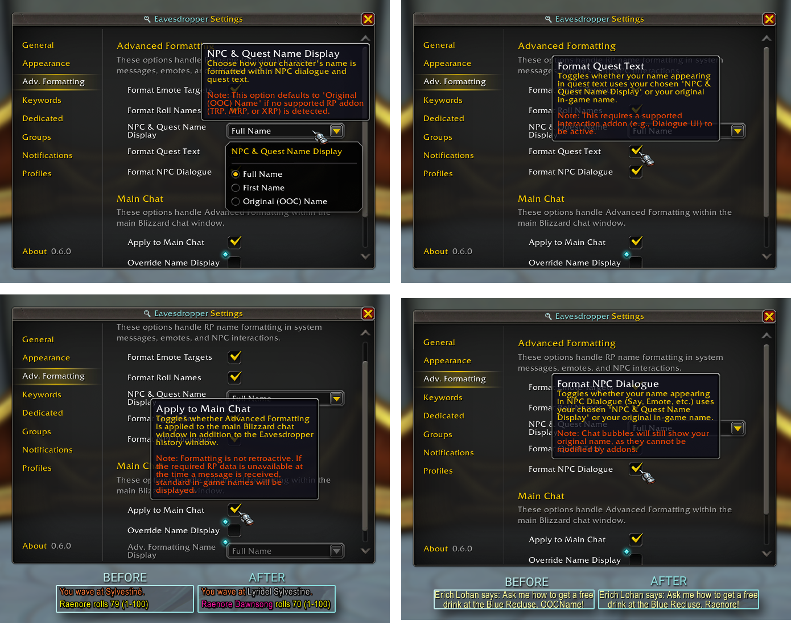](Previews/Combos/AdvancedFormatting.png)  
*Click the image to view it in full size.*
[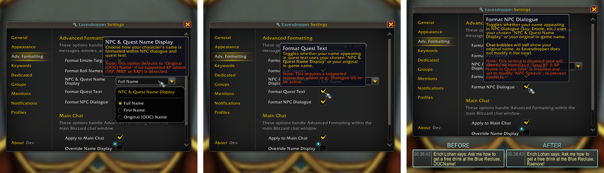](Previews/Combos/NPCDialogueAndQuestText.png)  
*Click the image to view it in full size.*
  

## Profiles & Sharing
Every character can run its own profile, ensuring your bank alt and main RP character maintain distinct setups. Profiles are managed under **Settings > Profiles**, where you can create, copy, rename, reset, and delete them.

**Import & Export:**
Export either your **Profile** (window styling, filters, keywords, notifications) or your **Account Settings** (options shared across all profiles, such as minimap button visibility) as a shareable text string for backups or sharing.

- **Readable Metadata:** Profile name, export date, and addon version sit in plain text at the top of the string so you know what you are looking at.
- **Auto-Detection:** The importer automatically recognizes whether you pasted a Profile or Account Settings string before you click Import.
- **Name Selection & Overwrite Protection:** Choose which profile name to import into, with a prompt warning you before overwriting an existing setup.
- **Graceful Error Handling:** Missing fonts or sounds fall back to default assets, out-of-range values auto-correct, and unrecognized settings are skipped and reported instead of breaking the import.

[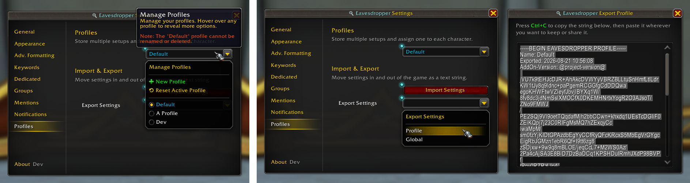](Previews/Combos/Profiles.png)  
*Click the image to view it in full size.*

## Localization
Eavesdropper is fully translated into **English** and **French**, with a partial **Russian** translation also available.

Translations for other languages are always welcome. If you would like to help translate Eavesdropper, feel free to open an issue or pull request on [GitHub](https://github.com/Raenore/Eavesdropper).
